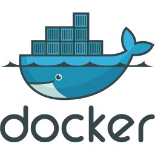

### Hi there

 
 
 

**🔥 About me 🔥**
- 💬 Nguyễn Lê Khương
- 📮Email Contact: lekhuong190602@gmail.com
- 💼 Php Developer (Laravel)

**🛠 &nbsp;Tools:**

<!-- VsCode -->

<code>&nbsp;</code>

<!-- Navicat -->

<code>&nbsp;</code>

<!-- Postman -->

<code>&nbsp;</code>

<!-- Docker -->

<code>&nbsp;</code>

 

**:computer:&nbsp;Languages and Library and Framework:**

<!-- Php -->
 <code>&nbsp;</code>

 <!-- Laravel -->

<code>&nbsp;</code>

<!-- Vue 3-->

<code>&nbsp;</code>

<!-- Html -->

<code>&nbsp;</code>

 <!-- Css -->

<code>&nbsp;</code>

 <!-- Js -->

<code>&nbsp;</code>

 <!-- Sass -->

<code>&nbsp;</code>

 <!-- Bootstrap -->

<code>&nbsp;</code>

 <!-- Tailwind -->

<code>&nbsp;</code>

 <!-- Jquery-->

<code>&nbsp;</code>

 

**:office:&nbsp;Database:**

<!-- MySql-->
 <code>&nbsp;</code>

<!-- MongoDb-->
<code>&nbsp;</code>

 <!-- Redis -->
<!-- <code>&nbsp;</code> -->

 

  

    
  

 

**:satisfied:&nbsp;Thanks for coming**

<!-- 

 -->
